# Essentials Kubernetes Concepts

Kubernetes is the leading container orchestration tool. It is the loosely coupled collection of components centered around deploying, maintaining and scaling workloads. Not attached to single company. 

#### What Kubernetes can do:

1. Service discovery and load balancing
2. Storage orchestration on local and cloud
3. Automated rollouts and rollbacks
4. Self healing 
5. Secret and configuration management
6. Use the same api on-premise and every cloud providers

#### What Kubernetes can't do

1. Doesn't deploy code
2. Doesn't build application
3. Doesn't provide application level service like caches, databases, buses etc.

#### Kubernetes Architecture

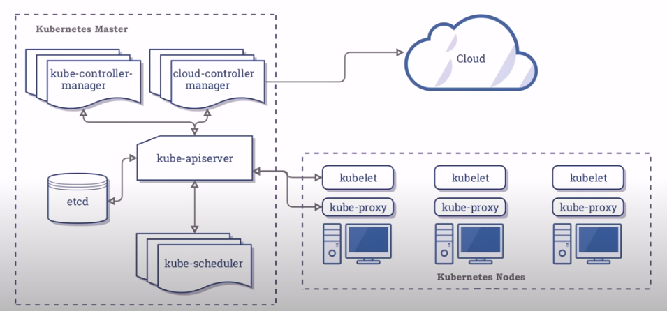

Kubernetes Master also know as Control Play on the left on the diagram runs the kuber services and controllers. And the Worker Nodes on the right runs the container that we deploy on the cluster. A single or multiple containers can run in the pod, a pod runs in a node, and all nodes forms a cluster.

#### Local k8s

Docker Desktop is limited to only 1 node. However tools like minikube, microk8s and kind can run multiple nodes

#### Kubernetes API

`kube-apiserver` exposes REST API to interact with the cluster state. We create yaml file for the desired state and give it to the REST API to interact with k8s cluster. 

#### Kubernetes CLI

`kubectl` is the kubernetes cli. It communicates with a kubernetes apiserver. And its configuration for communicating are stored locally on `C:\Users\{User}\.kube\config`

#### Kubernetes Context

Context is a group of access parameters to a k8s cluster. It contains the cluster name, user and namespace. The current cluster is the cluster that is by default for the kubectl. When we run commands in kubectl that is only apply to current default cluster. Below is the commands cheatsheet

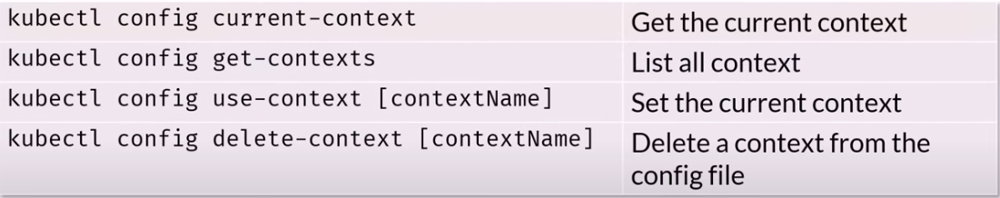

#### Declaravative vs Imperative 

There are 2 ways to create resources on kubernetes. 

1. Using kubectl to issue a series of commands
2. Using kubectl and yaml file defining the resource

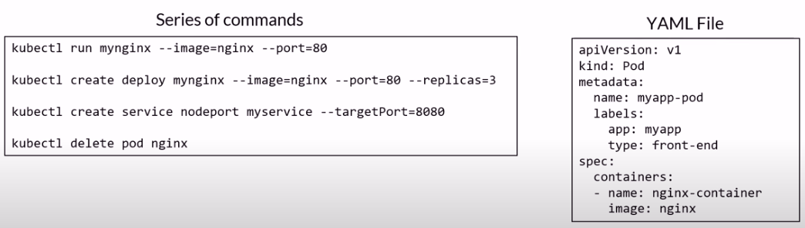

## Imperative

    kubectl create deployment mynginx1 --image=nginx

## Declarative

    kubectl create -f deploy-example.yaml

## Cleanup

    kubectl delete deployment mynginx1
    kubectl delete deploy mynginx2

# Namespaces

It allow to group other resource like dev, test, prod. They are like logical folder to group resources inside these folders. By default kubernetes creates a `default` workspace. Objects in one namespace can access objects in another namespace. Deleting a namespace will deletes all its child objects.

```bash
kubectl get ns
```

First we create a namespace using the below syntax for the yaml file and then we assign the pod to it.

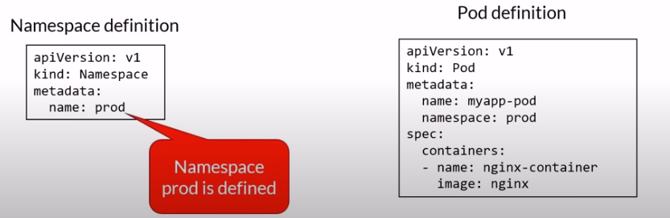

We can also design the network and resource policy for the namespace

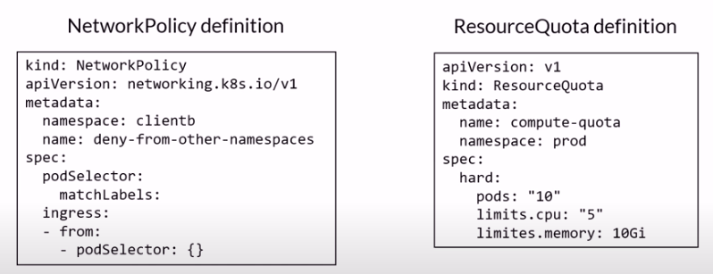


## Get namespaces

Open a terminal and get the currently configured namespaces.

    kubectl get namespaces
    kubectl get ns

## Get the pods list

Get a list of all the installed pods.

    kubectl get pods

We get the pods from the default namespace.  Try getting the pods from the docker namespace.  We will get a different list.

    kubectl get pods --namespace=kube-system
    kubectl get pods -n kube-system

## Change namespace

Change the namespace to the docker one and get the pods list.

    kubectl config set-context --current --namespace=kube-system

## Get the pods

    kubectl get pods

## Now change back to the default namespace

    kubectl config set-context --current --namespace=default
    kubectl get pods

## Create and delete a namespace

    kubectl create ns [name]
    kubectl get ns
    kubectl delete ns [name]

# Master Node

Node is a physical or virtual machine together they form a cluster. Kubernetes controller or service also refer as master components are located on Master Node also known as Control Plane. We don't run our containers on master node. In the master components there is `etcd` key value storage where state of the cluster is stored. `kube-apiserver` is the only component that communicate with the `etcd`. 

## ```kube-apiserver```

Api server exposes REST API so that client kubernetes cli `kubectl` can communicate with the `kube-apiserver` through the exposed REST API. It saves state to datastore `etcd`. All client communicate with the `kube-apiserver` to access the datastore `etcd`.

## ```etcd```

Acts as a datastore for storing state. It is not a database or datastore for the applications to use. 

## ```cloud-control-manager```

The controller of controllers. It manages the other controllers like
* Node controller
* Replication controller
* Endpoints controller
* Service account & Token controllers
* Interact with the cloud providers controllers
* Node: For checking the cloud provider to determine if a node has been deleted in the
cloud after it stops responding
* Route: For setting up routes in the underlying cloud infrastructure
* Service: For creating, updating and deleting cloud provider load balancers
* Volume: For creating, attaching, and mounting volumes, and interacting with the cloud provider to orchestrate volumes

## ```kube-scheduler```

Watches newly created pods that have no node assigned, and selects a node for them to run on.

Factors taken into account for scheduling decisions include
* Individual and collective resource requirements
* Hardware/software/policy constraints
* Affinity and anti-affinity specifications
* Data locality

`NOTE`: Above are the tool that come prebuild with the kubernetes. But we can add several addons like `DNS`, `Web UI (dashboard)`, `Cluster-level logging`, `Container resource monitoring`. 

#  Nodes

When a new worker node is created, kubernetes services are already added to the node `kube-proxy`, `kubelet`, `container runtime`. These are the services necessary to run pods and they are managed by the master components on the master node. 

## ```kubelet```

It manages the pod lifecycle and make sure that containers defined in the pod are running and healthy. 

## ```kube-proxy```

It is a network proxy. All network to the pod go through the `kube-proxy`. It also manages network rules. 

## ```container runtime```

On each node there is container runtime and kubernetes supports several runtimes. Must implement the Kubernetes Container Runtime Interface (CRI)
* Moby
* Containerd
* Cri-0
* Rkt
* Kata
* Virtlet 

### k8s pre V1.19 vs V1.19+

Kubernetes with the versions previous than V1.19 comes with pre-install with `Dockershim`. Which means we can access the container inside the pod. However versions after V1.19 don't come preinstalled with `Dockershim` which means we can't access the container inside the pod but it stills support docker containerization inside pod. Following are the changes that are made: 
* Since docker runtime is not installed. We can no longer access the Docker engine inside the cluster
* Docker commands won't run if we ssh into a node
* Use `crictl` instead. `crictl` is a command-line interface for CRI-compatible container runtimes. We can use it to inspect and debug container runtimes and applications on a Kubernetes node

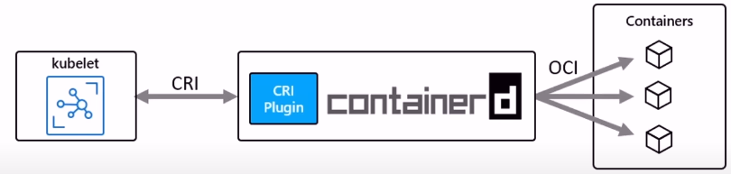

## Nodes pool

A node pool is a group virtual machines, all with the same size

A cluster can have multiple node pools. As example, we can have a cluster with two VM's first one with GPU's hence larges size and second one without GPU's hence smaller size.  
* These pools can host different sizes of VMs
* Each pool can be autoscaled independently from the other pools

Docker Desktop is limited to 1 node hence there are only master node and all the containers are on the same node.

## Get nodes information

Get a list of all the installed nodes. Using Docker Desktop, there should be only one.

    kubectl get nodes

Get some info about the node.

    kubectl describe node

# Pods

Atomic unit of the smallest unit of work of K8s. Encapsulates an application’s container. Represents a unit of deployment. Pods can run one or multiple containers. 

Containers within a pod share
* IP address space, mounted volumes

Containers within a pod can communicate via
* Localhost, IPC

Pods are ephemeral short-lived. Deploying a pod is an atomic operation, it succeed or not. If a pod fails, it is replaced with a new one with a shiny new IP address. We don’t update a pod that is currently running, we replace it with an updated version deleting the previous one and deploying a new one. We scale by adding more pods, not more containers in a pod. A node can run many pods and pods can run many containers. 

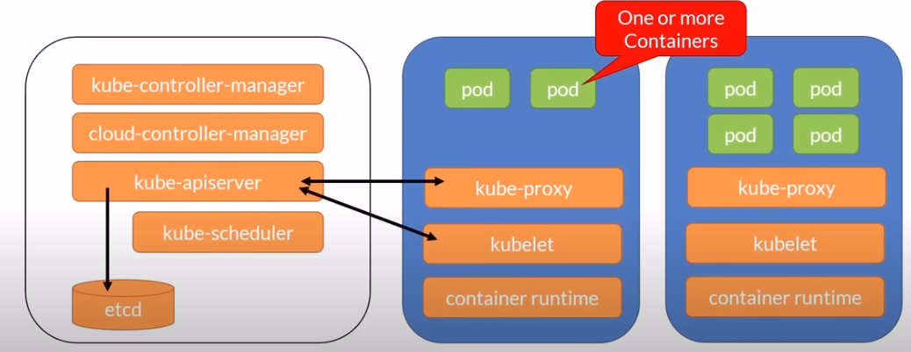

If there are more than one container in the pods there is the main container which contains the logic for the application and other containers contains the help function which helps the main container. 

## Pod Creation

When we issue a `kubectl create` command to create pod, cli sends information to the `apiserver` and that information is written into `etcd`. Then scheduler will watch for this information and look for the pods with that information and find one to schedule the pod and write the information in `etcd`. The `kubelet` running inside node will watch for that information and create a command for execution for that pod. Finally the status will be written in `etcd`.

Each time an operation is executing in a cluster the state is stored in `etcd`, hence `etcd` is the state of truth inside the cluster. 

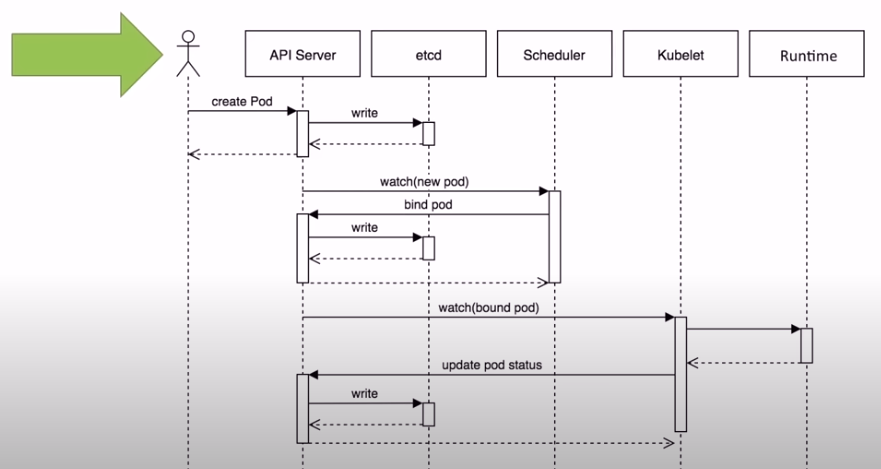

When we issue a `kubectl delete` command to delete a pod from cluster. Cli sends information to the `apiserver` that information is set into `etcd`. An grace period of 20 seconds will be added. `kubelet` will picks that information and sends terminating signal to the container. If container hangs it is killed after 30 seconds grace period and finally state is stored in `etcd`.

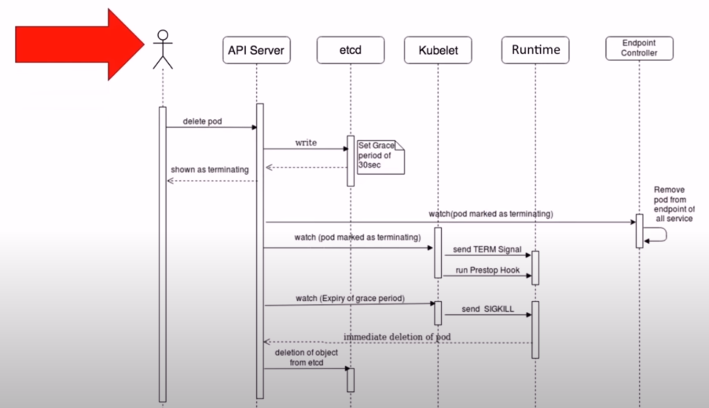

## Pod State

* Pending: Accepted but not yet created. Pod can be on pending if computing resource for creating pods are not available. 
* Running: Bound to a node
* Succeeded: Exited with status O
* Failed: All containers exit and at least one exited with non-zero status
* Unknow: Communication issues with the pod 
* CrashLoopBackOff: Started, crashed, started again, and then crashed again 

## `kubectl pod cheatsheet`

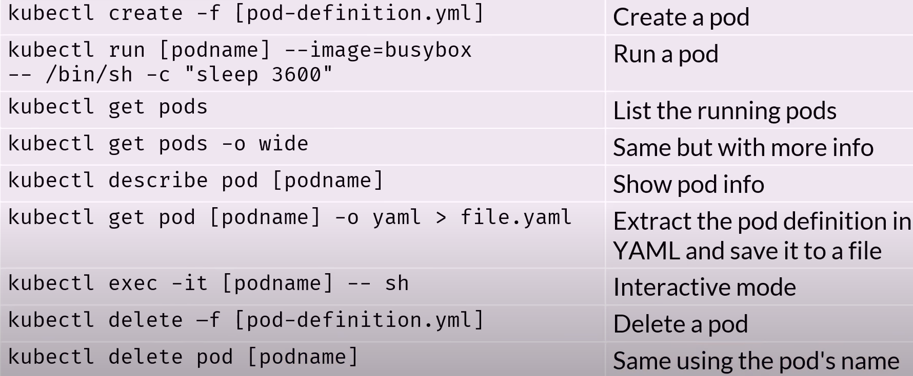

## Create the pod

    kubectl run mynginx --image=nginx

## Get a list of running pods

    kubectl get pods

## Get more info

    kubectl get pods -o wide
    kubectl describe pod mynginx

## Delete the pod

    kubectl delete pod mynginx

## Create a pod running BusyBox

Let’s now create a node running BusyBox, this time attaching bash to our terminal.

    kubectl run mybox --image=busybox -it -- /bin/sh

## List the folders and use command

    ls
    echo -n 'A Secret' | base64
    exit

## Cleanup

    kubectl delete pod mybox

## Create a pod using the declarative way

Let’s now create a node using a YAML file.

    kubectl create -f myapp.yaml

## Get some info

    kubectl get pods -o wide
    kubectl describe pod myapp-pod

## Attach our terminal

    kubectl exec -it myapp-pod -- bash

Print the DBCON environment variable that was set in the YAML file.

    echo $DBCON

## Detach from the instance

    exit

## Cleanup

    kubectl delete -f myapp.yaml

# Init Containers

If our application has dependencies on other compoenets like database, api, or files etc. We would use init containers to initialize the pod before an application container runs. Init containers make sure that the dependencies are initalized before the main logic container.

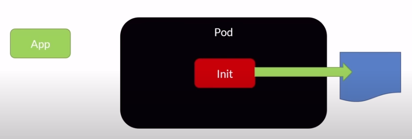

Always run to completion. Each init container must complete successfully before the next one starts. If it fails, the kubelet repeatedly restarts it until it succeeds
* Unless it's `restartPolicy` is set to Never

Probes are not supported
* livenessProbe, readinessProbe, or startupProbe

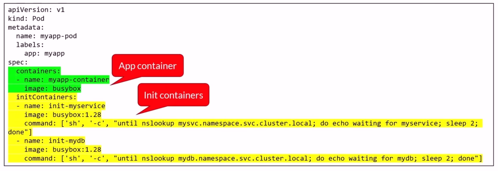

