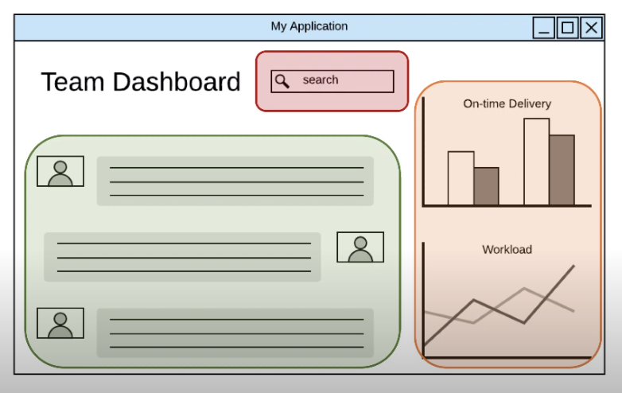
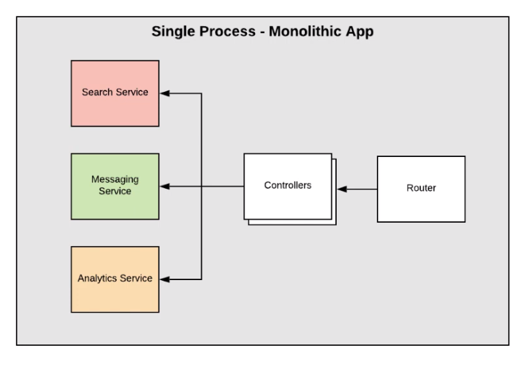
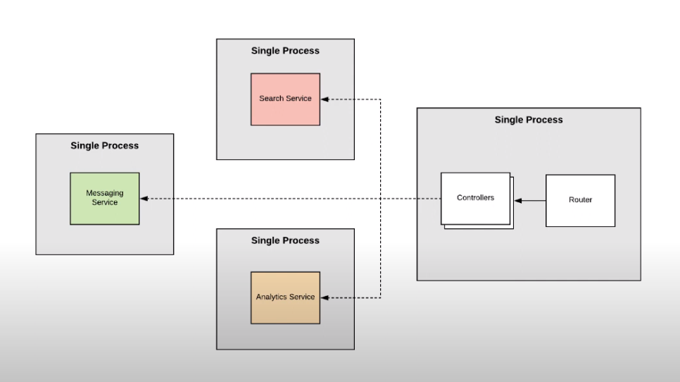
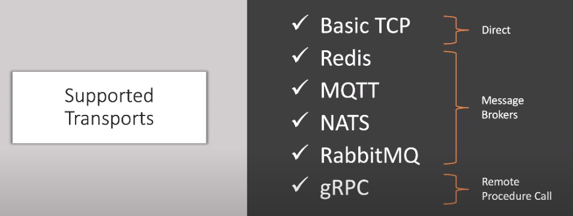

In the above scenario we have 3 main components in the application such as Search, Messaging and Analytics feature. 

If we were to define in a single nestjs application it will look something like this in a monolithic environment:

However in the microservice environment each service is seperated into different processes. 

Pros

+ Each service can be scaled individually
+ Easier to manage and deploy

Cons

- Complexity might increase
- Communication within different services requires extra configuration

Supported transports by Nestjs 

- TCP (default)
- Redis
- MQTT
- NATS
- RabbitMQ
- gRPC

