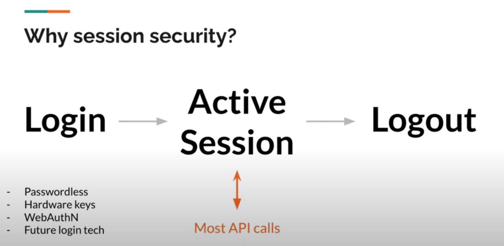
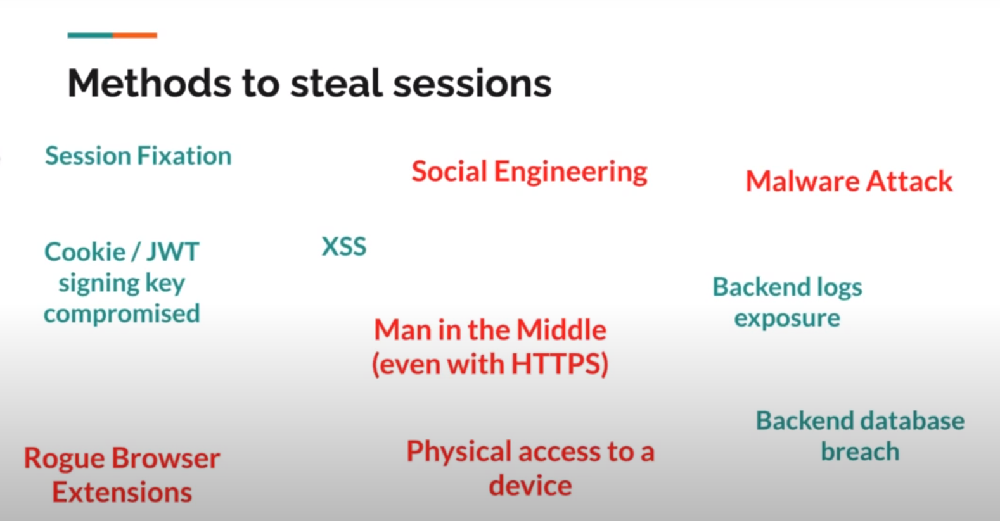
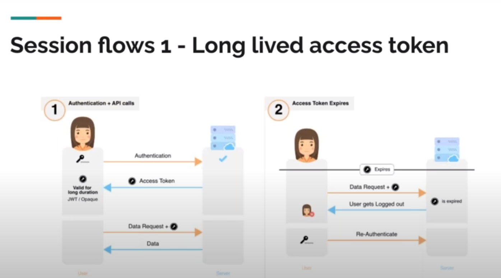
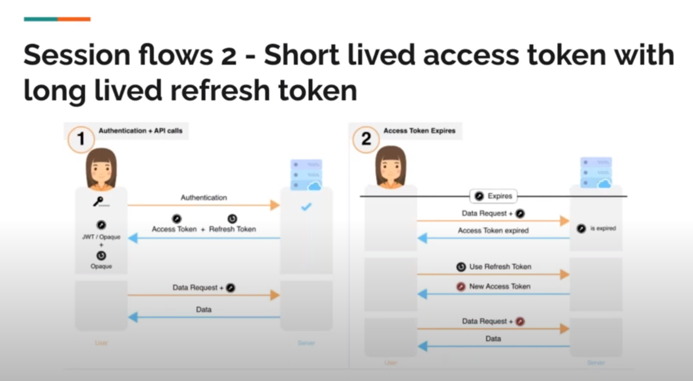
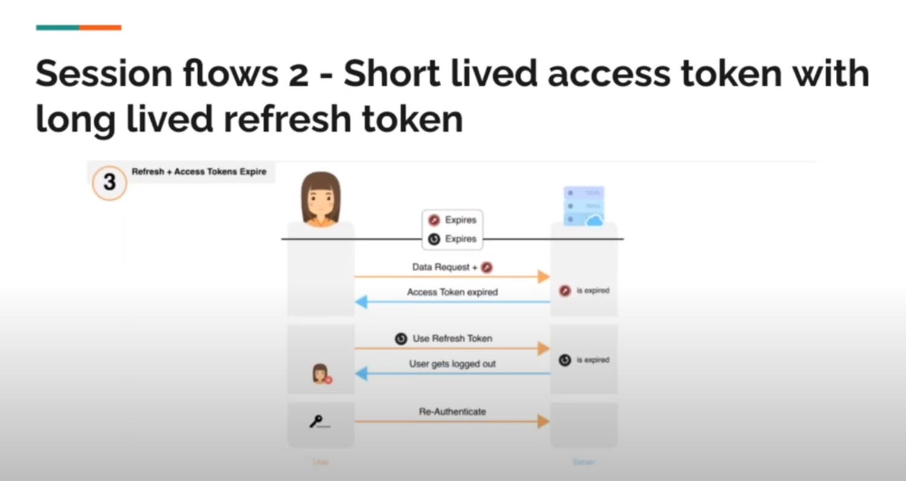
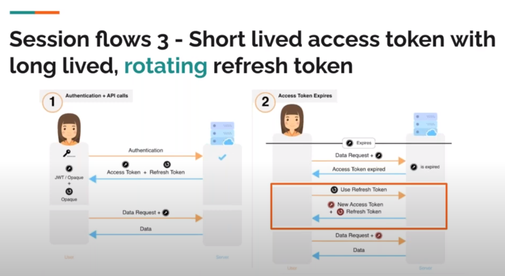
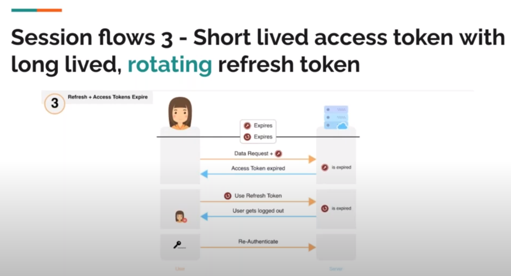
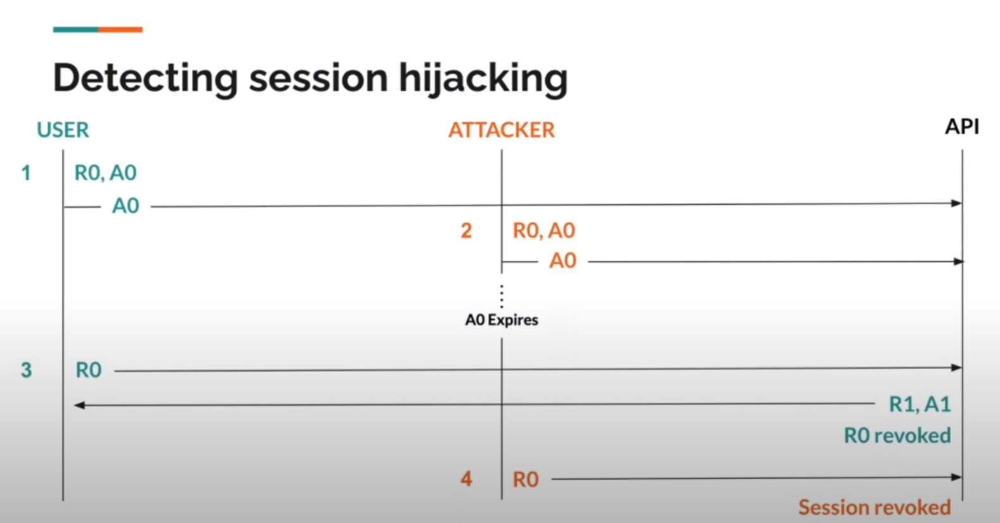
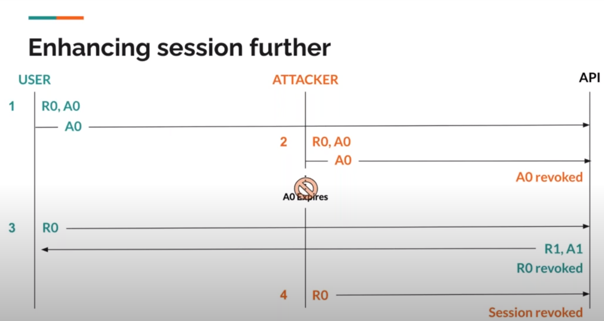

# Detecting session hijacking using rotating refresh tokens

Lots of the attacks that are being made nowadays are done by stealing the session id for the victim that has been generated after the login is being complete through social engineering or other means

Nowadays all security measures are implement in the login side like 2FA, Passwordless, Hardware Keys etc. However once user is being logged in there is not or little security left to identify either the user with the generated session id is legitimate.

Problems in the red are difficult to handle. 

Current State we are yet approaching the problem:

1. Request Ip Matching: When the user logs in we store the ip address of the user at that time. And every preceeding request we make sure that ip remains same otherwise revoke the session. Problem is it damage the user experience. If user travelling within the city or uses vpm, ip changes, hence user session breaks.

2. Device Fingerprinting: For every api call that browser makes we calculate the device fingerprint and attach it to the request header. Backend then checks if fingerprint changes overtime. If it does then it shows that session is being used on multiple devices. However this approach is very spoofable that hacker can calculate the victim device's fingerprint and attach it to its own request making it legitimate.

## Rotating Refresh Tokens

### Session Flow 1

Once user logs in we generate long lived access token which the user uses on preceeding requests. Once access token is expired user had to re-authenticate. Problem is access token can be compromised.

### Session Flow 2

When user logs in we generate short lived access token with long lived refresh token. User uses access token with every preceeding request and once the access token is expired user gets another access token by providing the refresh token. Once both tokens are expired user have to reauthenticate.

### Session Flow 3

When user logs in we generate short lived access token with long lived refresh token. User uses access token with every preceeding request and once the access token is expired user gets another access token by providing the old refresh token and also gets new refresh token. Once both the refresh and access token are expired, user have to reauthenticate.

Here is one slight drawback for the above approach. There is the possibility that attacker refresh R0 before the user and hence security is compromised. To overcome this issue we use the Ip Matching along with rotating refresh token.

In this way attacker can't use access token or refresh token because of different Ip Address its request will be rejected.